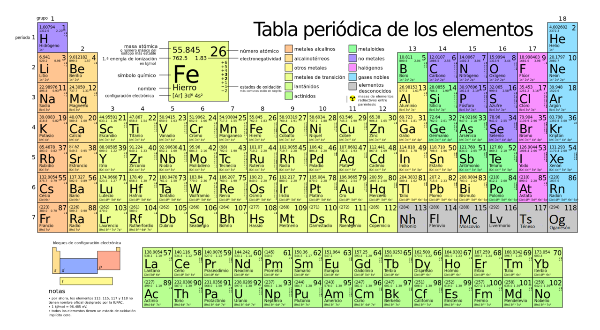

<h1 align="center">💻 atomStruck 🧪</h1>

Guía de información acerca de elementos químicos. El programa està desarrollado enteramente en C++.

  <!-- C++ -->
  

## ⚙️ Estructura
Mediante un Input se ingresa el número atómico y usando una estructura de control switch se muestra en pantalla la información de ese elemento químico.

## 🛠️ Información de elementos químicos
[Lista de elementos químicos](https://www.periodni.com/es/elementos_clasificados_por_numero_atomico.html)
[Elementos químicos de tabla periódica](https://es.wikipedia.org/wiki/Elemento_qu%C3%ADmico)

De Ignacitum - Trabajo propio, CC BY-SA 4.0, https://commons.wikimedia.org/w/index.php?curid=53852661

## ✒️ Desarrollador
[Marcelo Arias Saavedra](https://marceloarias.com/)
