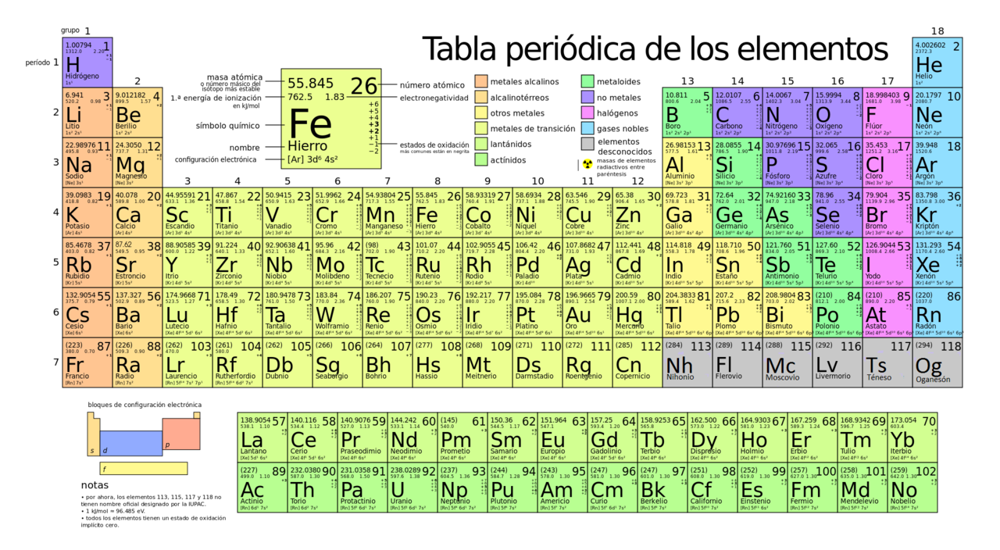

<h1 align="center">💻 atomStruck 🧪</h1>

Information guide about chemical elements. The program is developed entirely in C++.

  <!-- C++ -->
  

## ⚙️ Structure
By means of an Input the atomic number is entered and using a switch control structure the information of that chemical element is displayed on the screen.

## 🛠️ Chemical element information
[List of chemical elements](https://www.periodni.com/es/elementos_clasificados_por_numero_atomico.html)
[Periodic table chemical elements](https://es.wikipedia.org/wiki/Elemento_qu%C3%ADmico)

De Ignacitum - Trabajo propio, CC BY-SA 4.0, https://commons.wikimedia.org/w/index.php?curid=53852661

## ✒️ Author
[Marcelo Arias Saavedra](https://marceloarias.com/)
